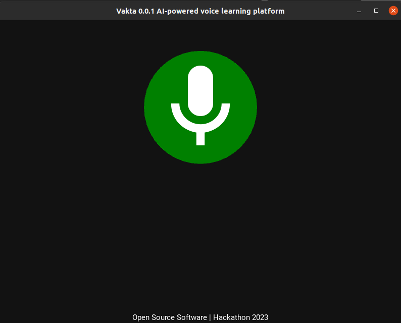

# Vakta Voicebot - Empowering Visually Impaired Community with AI

## Introduction
Introducing <strong>"Vakta 0.0.1"</strong> - an innovative and cutting-edge GUI based project developed for the Hackathon. Vakta is a state-of-the-art, fully voice-activated, and AI-enabled assistant, thoughtfully designed with the primary objective of <strong>empowering the visually impaired community</strong>. with adaptive learning technology. With an unwavering commitment to providing an inclusive and seamless user experience, Vakta will revolutionize the way blind individuals interact with technology.

<strong>"Vakta"</strong> is a Sanskrit word for <strong>"speaker."</strong> In our project, Vakta embodies this essence by becoming a compassionate and intelligent mentor for the visually impaired. Just as ancient speakers conveyed wisdom, Vakta aims to create a future of inclusivity and empowerment, bridging the gap between the visually impaired and knowledge.

## Features
1. **Voice-activated Information (General Mode):**
   - Engage in voice-based conversations with OpenAI's LLM, powered by Eleven Lab's voice model and Langchain, utilizing memory to retain context throughout the interaction.
   - Allows the individual to ask any question and get the answer through voice. Questions like “ What is the Capital of France? ” or “ Define Osmosis” are some examples.
   - To conclude, this feature is simply our favorite ChatGPT in voice form.

2. **Listen to your favorite book (Book Mode):**
   - Download the pdf of the requested book and play it like an audiobook.
   - Control to stop and continue listening.
   - Powered by various NLP algorithms and search techniques using Google Books API.

3. **Know the weather around you (Weather Mode):**
   - Ask the AI about the weather of a particular city.
   - AI responds with accurate temperature, humidity, and wind speed. For example, "What is the weather of Delhi?"

4. **Stay Updated with the latest news (News Mode):**
   - Request for news headlines of a particular category or in general.
   - AI responds with the latest headlines from categories like Sports, Technology, Business, etc.

5. **Search and Listen to Music or Podcasts (YouTube Mode):**
   - Empowers the user to search any song or video from YouTube.
   - Example: "Simon Sinek: How Great Leaders Inspire Action | TED Talk" or "Believer | Imagine Dragons."

## Voice Commands:
- **General Mode:** The AI operates in the general chat mode (Feature 1) if no specific command is used.
- **Book Mode:** Enable book mode by saying "Download book <book_name>."
- **Weather Mode:** Enable weather mode by saying "weather <your_city_name>."
- **News Mode:** Enable news mode by saying "Search News <category>."
- **YouTube Mode:** Enable YouTube mode by saying "YouTube" and then provide the video title when prompted.
- **Exit Program:** Say "Exit Program" to close the application.

## Tech Stack
- GUI: KivyMD Framework (Python)

## APIs Used
- [ElevenLabs API](https://elevenlabs.io/)
- [OpenAI](https://platform.openai.com/)
- [NewsAPI](https://newsapi.org/)
- [Google Books](https://developers.google.com/books)
- [Open Weather Map](https://home.openweathermap.org/)

## Developer Machine Setup
1. Clone the repository:
<code>git clone https://github.com/krrish-v/vakta.git && cd vakta</code>
2. Install python if not installed on your system  
- In Windows : [python website](https://www.python.org/downloads/) 
- In Linux : <code>sudo apt install python3</code>
3. Create a virtual environment
- If virtualenv is not installed : <code>pip install virtualenv && virtualenv env</code>
- Activate virtual environment 
a. In Windows : <code>env/Scripts/activate</code> 
b. In Linux or MacOS: <code>source env/bin/activate</code>
4. Install dependencies: <code>pip install --upgrade pip -r requirements.txt</code>
5. <code>pip install https://github.com/yt-dlp/yt-dlp/archive/master.tar.gz</code>
6. Move to GUI directory and run main.py file
## Future Scope
- Make the app available for Android and iOS devices since Kivy is a cross-platform Python framework.
- Enhance the features and make it a fully ready platform for voice-based learning.
- Release the app in the market, possibly on a subscription-based model.

## References
- [Kivy documentation](https://kivy.org/doc/stable/gettingstarted/intro.html)
- [ElevenLabs API Reference](https://docs.elevenlabs.io/api-reference/quick-start/introduction)
- [NewsAPI Reference](https://newsapi.org/docs)
- [Langchain documentation](https://python.langchain.com/docs/get_started/introduction.html)

