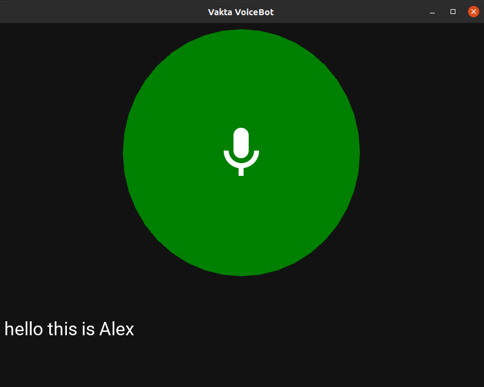

# Vakta 0.0.1 - AI-powered voice learning platform designed to assist individuals with visual impairments.

Introducing a new desktop app designed specifically for individuals with visual impairments. Using voice-activated search, the app provides users with seamless access to a wide range of information,

### Features

#### 1. Voice-Activated Search
#### 2. Integrated Voice Books
#### 3. Integrated ChatGPT
#### 4. Integrated News Delivery based on defined category 
#### 5. Integrated Weather Reporting
#### 6. Search any song or video like "Simon Sinek: How great leaders inspire action | TED Talk" etc.. avaliable on a YouTube and get a running audio file

